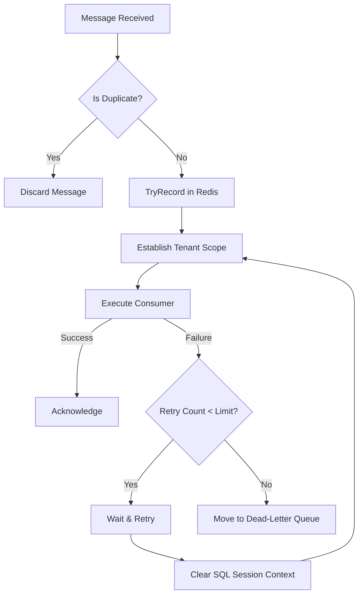

# Replay & Retry Flow Specification

This document defines how the Karamchari platform manages transient failures, duplicate message deliveries, and ensures double-processing does not compromise system consistency.

---

## 1. Core Concepts

-   **Retry**: A process where a failed operation is attempted again. It increments the `RetryAttempt` metadata counter but uses the *exact same* execution envelope.
-   **Replay**: The delivery of an identical message twice by the message broker. It is intercepted by the replay protection infrastructure.

### Execution Flow Chart

---

## 2. Process Details

### Retry Flow
1.  A message consumer encounters an exception (e.g. a SQL deadlock).
2.  MassTransit's retry policy interceptor captures the failure.
3.  Before execution resumes, the system clears the current SQL connection state via `RetrySafeSessionReset`.
4.  The `TenantConsumeFilter` extracts the envelope, increments `RetryAttempt`, and establishes a fresh `TenantExecutionContext` scope.
5.  The consumer runs again with a clean slate.

### Replay Flow
1.  An incoming message reaches the `TenantConsumeFilter`.
2.  The filter extracts the `MessageId` and active `TenantId`.
3.  The filter invokes `ReplayProtectionService.TryRecord()`.
4.  The service attempts to obtain an atomic Redis lock (`SETNX`) keyed by the message ID and content hash.
5.  If the lock exists, the message is identified as a duplicate and immediately discarded without invoking the consumer.

---

## 3. Debugging Strategy

-   **Duplicate Detection Verification**: Check the Redis cache for keys matching `replay:{MessageId}`. If present, the message is safely discarded. Seq will show warnings for "Duplicate message discarded" and skip business logic.
-   **Retry Storms**: Filter Seq logs for `tenant.retry_attempt > 0`. If retry counts are high, investigate SQL database connection deadlocks or dependent service latency.
-   **Invariants**: State is never carried over between retries. Duplicate messages never reach target business logic.
