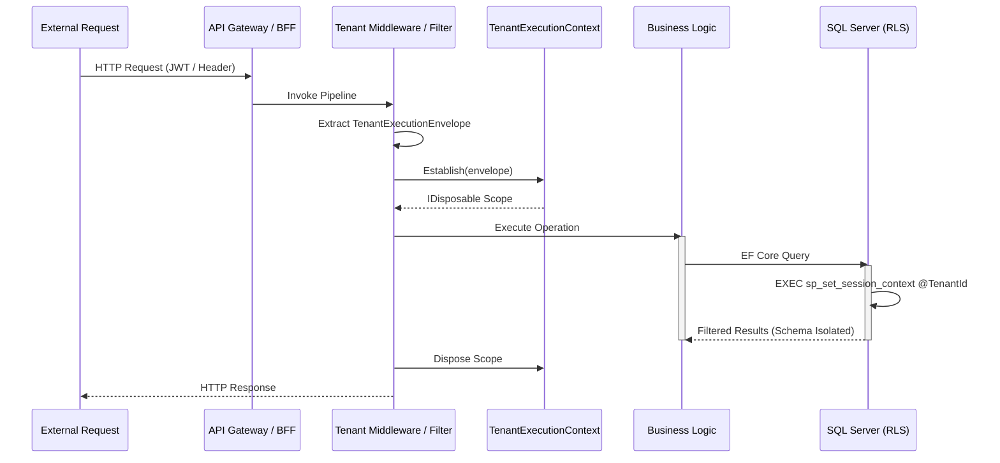

# Tenant Execution Flow Specification

This document defines how the Karamchari platform isolates execution context, handles database-layer multi-tenancy, and routes operations within a bounded tenant context.

---

## 1. Core Concept: `TenantExecutionContext`

To guarantee strict isolation, the platform uses an ambient, immutable **Execution Scope** rather than passing tenant keys through application services. All database connections, cache access, and log contexts are automatically resolved against the active scope.

### The Lifecycle Sequence

---

## 2. Execution Phases

1.  **Entry Point (The Air Lock)**: A request enters via HTTP, RabbitMQ, or a background worker.
2.  **Extraction**: Infrastructure filters extract the `TenantExecutionEnvelope` (containing Tenant ID and Correlation ID).
3.  **Establishment**: Infrastructure calls `TenantExecutionContext.Establish()`, locking the current async local execution flow to the active tenant.
4.  **Execution**: Business logic executes without seeing or managing the Tenant ID directly.
5.  **Data Access**: EF Core interceptors (`TenantSchemaCommandInterceptor` and `RlsSessionContextInterceptor`) intercept the query, set the session context, and rewrite schema names to resolve SQL records under the active tenant's schema boundary.
6.  **Exit**: The scope is disposed, cleaning the async thread context.

---

## 3. Debugging Strategy & Common Issues

-   **Missing Context**: If an operation fails with `TenantResolutionException`, it means the execution context was lost (e.g. executing on an unawaited Task or using raw `Task.Run` without capturing the context).
-   **Cross-Tenant Connection Contamination**: A `PooledConnectionContaminationException` indicates that a thread tried to access database data using a connection configured for a different tenant.
-   **Traceability**: Search Seq for `karamchari.tenant.id` or `karamchari.correlation.id`. Telemetry automatically correlates all SQL command rewrites, logs, and trace spans.

---

## 4. Architectural Invariants
-   **Immutability**: Tenant context cannot be changed or overridden mid-execution.
-   **Mandatory Enforcement**: No database or transaction operation can execute without an established execution context.
