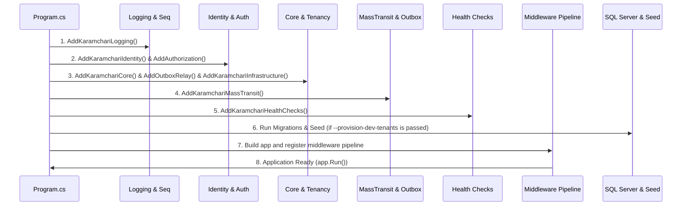

# Application Startup Sequence

This document details the startup sequence of the Karamchari modular monolith from the main entry point `Program.cs` until the application is ready to process requests.

---

## 1. Sequence Overview
The application initializes in a linear sequence using the ASP.NET Core `WebApplicationBuilder`. The sequence is structured as follows:

---

## 2. Startup Phases Detailed

### Phase A: Configuration Loading
- **Entry Point**: `Program.cs` line 9 (`WebApplication.CreateBuilder(args)`).
- **Behavior**: The framework automatically scans and loads environment configurations in order of increasing priority:
  1. `appsettings.json`
  2. `appsettings.{Environment}.json` (e.g., `appsettings.Development.json` or `appsettings.Local.json`)
  3. Environment variables (e.g., connection strings mapped via `ConnectionStrings__KaramchariDb` in Docker Compose).
  4. Command-line arguments.

### Phase B: Dependency Injection (DI) Registration

#### 1. Logging & Observability
- **Code**: `builder.AddKaramchariLogging();` (`LoggingExtensions.cs`)
- **Action**: Configures Serilog as the primary logging provider. Enables:
  - Console Logging for local terminal visibility.
  - OpenTelemetry Protocol (OTLP) sink pointing to `otel-collector` (port 4317) for trace/log ingestion into Seq (port 8081).

#### 2. Identity & Security (Enterprise Foundation)
- **Code**: 
  - `builder.Services.AddKaramchariIdentity(builder.Configuration);`
  - `builder.Services.AddAuthorization(options => options.AddKaramchariPermissionPolicies());`
- **Action**:
  - Registers JWT Bearer validation middleware pointing to the configured developer JWT token authority (dotnet-user-jwts).
  - Registers ASP.NET Core Identity services using the EF Core stores on `IdentityDbContext`.
  - Scopes authentication token generation services (`IJwtTokenService`, `IRefreshTokenService`).
  - Automatically translates `Permissions.All` collection into individual granular policy authorizations.

#### 3. Core, Multi-Tenancy & Persistence
- **Code**:
  - `builder.Services.AddKaramchariCore(builder.Configuration);`
  - `builder.Services.AddOutboxRelay(builder.Configuration);`
- **Action**:
  - **CoreDbContext** is registered using the `KaramchariDb` connection string.
  - **Interceptors Registration**: Stateless EF interceptors (`RlsSessionContextInterceptor`, `TenantSchemaCommandInterceptor`, `TenantStampingInterceptor`, `DomainEventDispatchInterceptor`) are registered in DI.
  - **Tenancy**: Registers `HttpTenantProvider` as the scoped resolver. Registers `TenantTableRegistry` as a singleton to track tenant-owned database tables.
  - **Outbox Relay**: Registers `OutboxRelayDbContext` (without RLS/tenant interceptors) and starts the background `OutboxRelayService` to poll and dispatch transactional outbox events to the message broker.

#### 4. Bounded Context Services & MassTransit
- **Code**: `builder.Services.AddKaramchariMassTransit(builder.Configuration, builder.Environment);`
- **Action**:
  - Automatically loads and executes the `RegisterServices` method for all bounded contexts registered in `CapabilityRegistry`.
  - Configures **MassTransit** to run either in-memory (if no connection string is provided in development) or via **RabbitMQ** (using the `RabbitMQ` connection string).
  - Registers the Entity Framework Outbox for 12 DbContexts (`HRDbContext`, `FinancialOpsDbContext`, etc.).

#### 5. Health Checks
- **Code**: `builder.Services.AddKaramchariHealthChecks(builder.Configuration);`
- **Action**: Registers health checks for the 14 main databases (DbContexts), RabbitMQ connectivity, and Redis connectivity.

---

### Phase C: Middleware Pipeline Construction
- **Code**: `var app = builder.Build();` and subsequent middleware chain.
- **Order of Execution**:
  1. **Exception Handler**: Catches all unhandled exceptions and writes standard problem details responses.
  2. **Rate Limiting**: Fixed window limiters applied to critical endpoints.
  3. **Authentication**: `UseAuthentication()` decodes and maps JWT claims into the execution principal.
  4. **Tenant Authorization**: `UseKaramchariTenantAuthorization()` extracts the `tenant_id` from claims and verifies tenant formatting.
  5. **Authorization**: `UseAuthorization()` evaluates policies.
  6. **Tenant Observability**: `UseKaramchariTenantObservability()` binds the current tenant identifier to the trace activity tag.
  7. **Endpoints**: Maps SignalR hubs, minimal API endpoints via capability modules, and health check endpoints.

---

## 3. Database Migration & Tenant Provisioning
If the startup command includes the `--provision-dev-tenants` flag (during setup/bootstrap):
1. **Schema Migrations**: Loops through the registered list of 16 DbContext types in `Program.cs` and executes `db.Database.MigrateAsync()` synchronously on SQL Server.
2. **RLS Predicate Function**: Executes `TenantProvisioningService.ProvisionRlsInfrastructureAsync()` to deploy the core security function `fn_SecurityPredicate` in the database.
3. **Tenant Provisioning**: Provisions individual test schemas by running `ProvisionTenantAsync` for `dev`, `acme`, and `contoso` schemas.
4. **Data Seeding**: Clones the core table structures into the new tenant schemas and executes `docs/seed/local-dev-seed.sql` to populate default user data.
