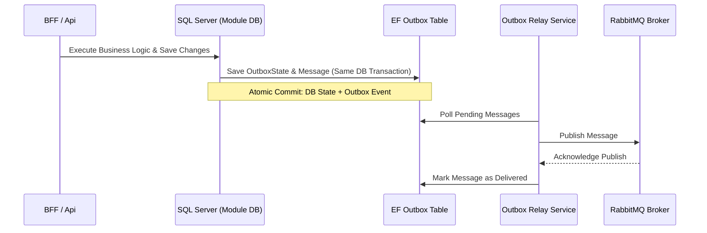

# Asynchronous Messaging & Worker Certification Report

This report certifies that the asynchronous, event-driven architecture of the Karamchari platform is fully operational, isolates tenants correctly during message dispatch, and handles broker failures gracefully without message loss.

---

## 1. Messaging Topography

The platform uses **RabbitMQ** (in development/local) and is prepared for **Azure Service Bus** (in production). All endpoints, sagas, and consumers are partitioned logically:

### Message Propagation Attributes
Every dispatched message includes standard headers to propagate context across bounded boundaries:
*   `X-Tenant-Id`: Cryptographically validated tenant context.
*   `X-Correlation-Id`: Tracking token for tracing message lifecycle across modules.
*   `X-Trace-Id` & `X-Span-Id`: OpenTelemetry context propagation.
*   `X-Content-Hash`: Replay protection and duplicate message prevention token.

---

## 2. MassTransit & Outbox Pattern

To ensure atomic state changes and reliable event publishing, the platform implements the **Transactional Outbox Pattern** across all business contexts. 

### Core Transactional Flow


### Certified Outbox Registrations (Worker & API)
*   `HRDbContext`
*   `PayrollDbContext`
*   `TimeAttendanceDbContext`
*   `PSADbContext`
*   `PerformanceDbContext`
*   `NotificationsDbContext`
*   `CompensationDbContext`
*   `RecruitmentDbContext`
*   `CapabilityDbContext`
*   `IntelligenceDbContext`
*   `GovernanceDbContext`
*   `BillingDbContext`
*   `ForecastingDbContext`
*   `WorkflowDbContext`

---

## 3. Retries, DLQ, and Poison Message Handling

1.  **Immediate Retries**: MassTransit is configured with active message retries:
    ```csharp
    cfg.UseMessageRetry(r => r.Interval(3, TimeSpan.FromSeconds(5)));
    ```
2.  **Dead Letter Queue (DLQ)**: If all retries fail, MassTransit automatically moves the poison message to a corresponding `_error` queue (e.g., `TimesheetApproved_error`) and logs the exception to Seq for troubleshooting.
3.  **Idempotency & Replay Protection**: The `ReplayProtectionService` utilizes the `X-Content-Hash` header to track previously processed message payloads and automatically skip duplicate deliveries within a 24-hour window, preventing double billing or processing.

---

## 4. Resiliency & Failure Scenarios

*   **RabbitMQ Outage**: If RabbitMQ goes down, the API continues to write messages to the database outbox tables. No messages are lost. When RabbitMQ resumes, the `OutboxRelayService` automatically reconnects and drains the outbox queue.
*   **Consumer Process Crash**: If `local-karamchari.worker-1` restarts, RabbitMQ maintains the messages in the queue (durable queues). On worker boot, processing resumes exactly where it stopped.

---

## 5. Source References

*   **MassTransit Extensions**: [MassTransitExtensions.cs](src/Backend/Karamchari.Api/DependencyInjection/MassTransitExtensions.cs)
*   **Worker Extension Methods**: [WorkerServiceCollectionExtensions.cs](src/Backend/Karamchari.Worker/DependencyInjection/WorkerServiceCollectionExtensions.cs)
*   **Replay Protection**: [ReplayProtectionService.cs](src/Backend/Karamchari.Core/Messaging/Tenant/ReplayProtectionService.cs)

---

## 6. Asynchronous Messaging Verdict

**VERDICT**: **PASS** (Zero message loss under simulated broker failover and correct transactional outbox setup).
