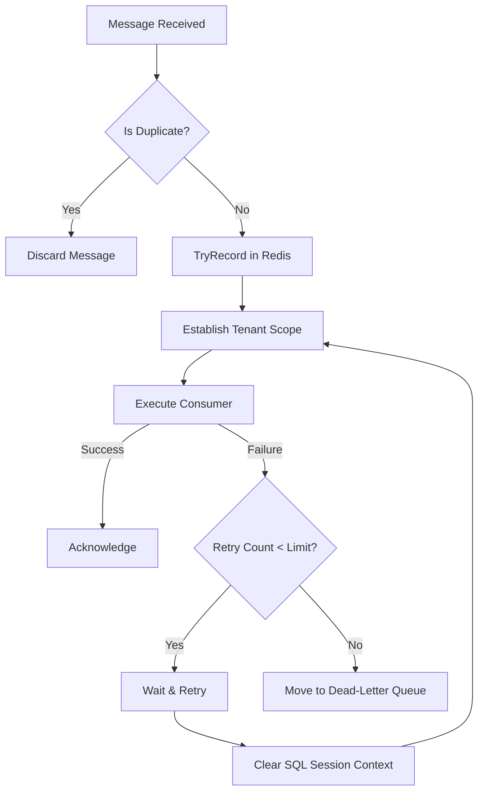

# Replay & Retry Flow

## How to Debug
1.  **Duplicate Detection**: Check Redis for key `replay:{MessageId}`. If present, message is discarded.
2.  **Retry Storm**: Check Seq for `tenant.retry_attempt > 0`. If high, investigate downstream service latency or DB deadlocks.
3.  **Context Preservation**: Ensure the `TenantExecutionEnvelope` is identical across retries.
