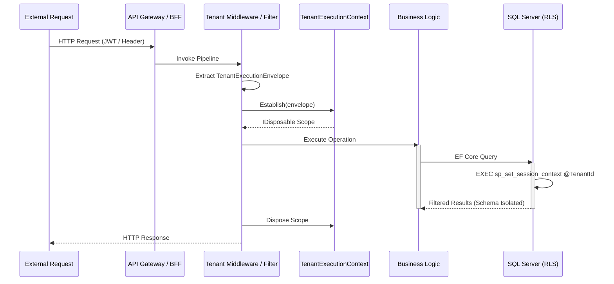

# Tenant Execution Flow

## How to Debug
1.  **Missing Tenant**: Exception `TenantResolutionException` at **Middleware** level. Check JWT claims or `X-Tenant-Id` header.
2.  **Cross-Tenant Leak**: Exception `PooledConnectionContaminationException` at **DB** level. Check for unawaited Tasks or background thread escape.
3.  **Traceability**: Search Seq for `karamchari.tenant.id`. Every step above is automatically tagged.
